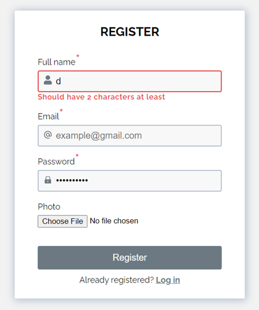
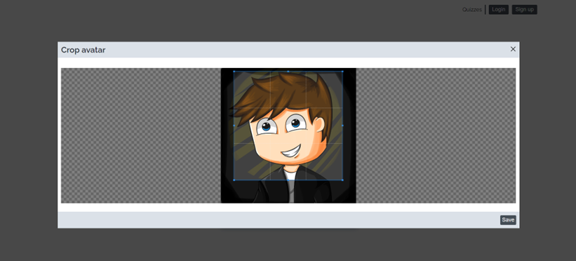
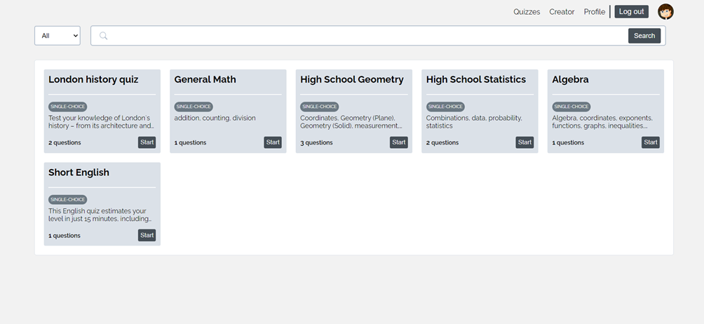
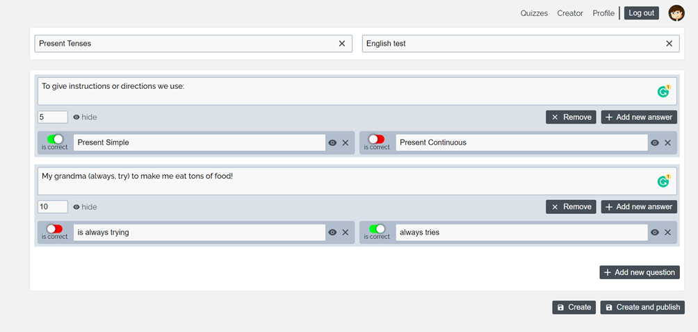
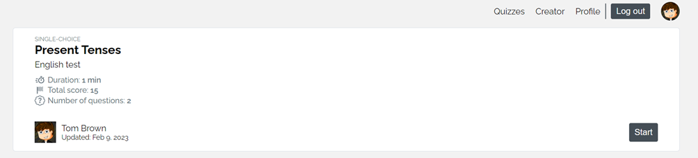
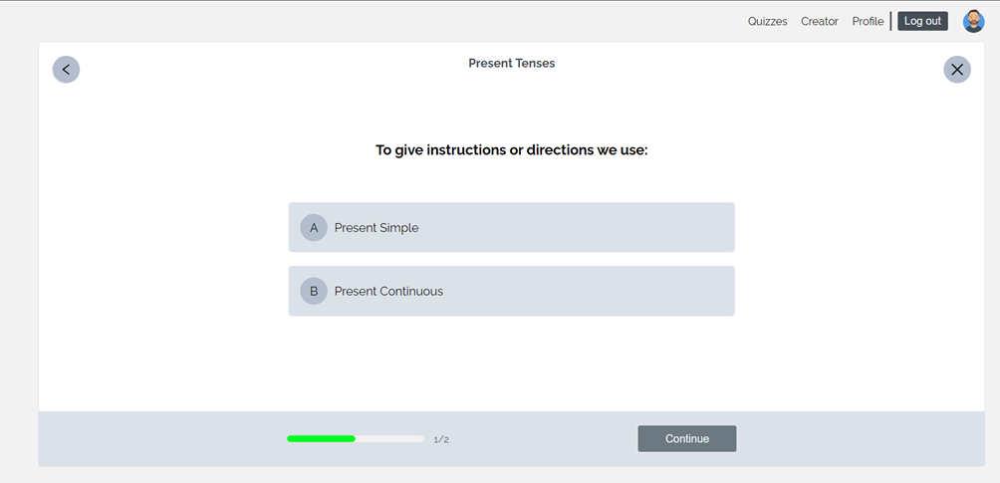
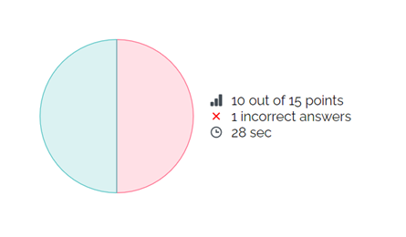
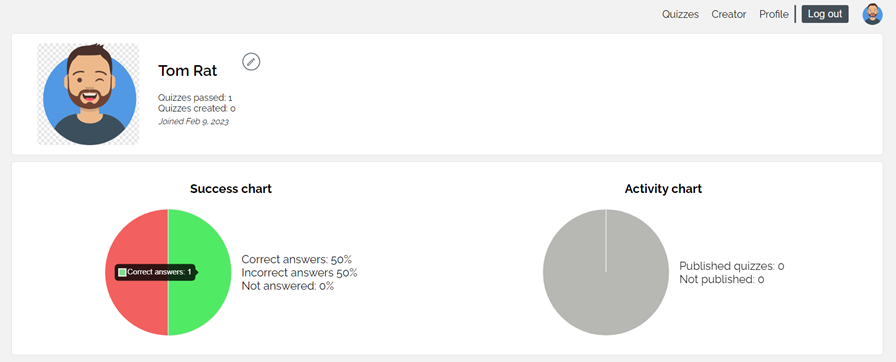
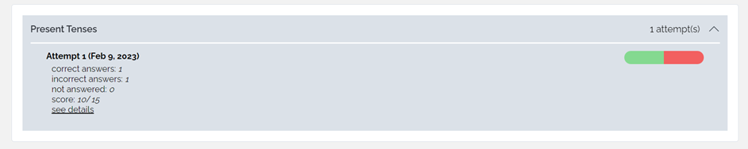
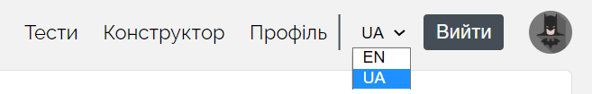

# Quiz app

App for creating and taking quizzes

## Backend
For the BackEnd to work properly, you need to fill in the .env file. You can use the .env.example file as an example

## Frontend
For the FrontEnd to work properly, you need to fill in the .env file. You can use the .env.example file as an example

## Start
npm run start - for frontend 
npm run dev - for backend

## Overview

* #### Signup

* #### Uploading avatar

* #### Main page

* #### Quiz builder

* #### Specific quiz page

* #### Passing

* #### Results

* #### Profile page

* #### Attempts history

* #### Internationalization

